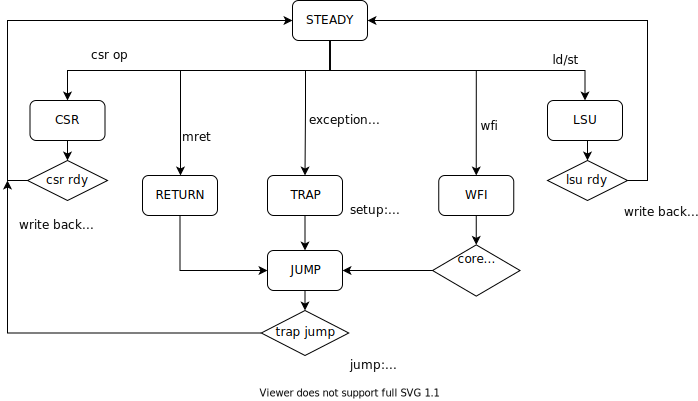

# Instruction Execute

The Execute stage which you have been reading so much about in the previous sections wraps the ALU, LSU and CSR. It also has logic for direct register writes, branching, catching exceptions and acting upon them. There's a control sequencer which manages all of them, upon receiving the decoded operands and controls from from the Decode stage.

# ALU Design

ADD and SUB can be calculated with a simple 32b adder. `cin`, the adder carry-in inverts the operand for subtraction. The outputs of the adder are `R_ADD`, the 32b result, and `cout`, the carry-out (or overflow). Signed less than is derived from the sign of the subtraction result and the operands, whereas the unsigned less than is simply the inverted `cout`.

There's a 32b Right Barrel Shifter which can be used for SHR and SHRA. If you reverse (`rev`) the operand before and after the right barrel shifter, you can use if for left shifts (SHL). Arithmetic shift right, where the value shifted in is the sign of the operand, is selected by `cin`. The result is R_SHIFT.

Finally, the logical operations, AND, OR and XOR generate R_AND, R_OR and R_XOR. 

Function | Operation | ALUOP | result
:----|----|----|----|
ADD  | result = op1 + op2          |0000    | R_ADD
SUB  | result = op1 - op2          |1000    | R_ADD
LT   | result = op1 < op2          |0010    | R_COMP
LTU  | result = op1 <u op2         |0011    | R_COMP
XOR  | result = op1 ^ op2          |0100    | R_XOR
OR   | result = op1 \| op2         |0110    | R_OR
AND  | result = op1 & op2          |0111    | R_AND
SHL  | result = op1 << op2[4:0]    |0001    | R_SHIFT
SHR  | result = op1 >> op2[4:0]    |0101    | R_SHIFT
SHRA | result = op1 >>> op2[4:0]   |1101    | R_SHIFT
 

The decoder generates the above ALUOP from the `funct3` and `funct7` (**as is**) for OPIMM and OP instructions, and defaults to ADD for other instructions. The ALU generates 5 result pathways, and the output mux deciding `result` is selected as per the ALUOP.

# Data Memory Access

The Load Store Unit (LSU) in the Execute stage operates on all data memory access instructions. The LSU is a Wishbone pipelined master with read/write control (unlike the Fetch stage which only reads from the instruction memory).

The memory access address is in `addr`, and for store instructions the mask and write data are also packed along from the Decode stage. Store data/mask as passed forward as is. For load instructions, the data read from the memory is byte-rotated and then sign-extended to obtain the load data.

Byte access are always aligned. Halfword access are misaligned if the byte offset is not 0 or 2. Word access are misaligned if the byte offset is not 0. 

> Kronos core does not support misaligned memory access, and will throw an exception.

#### Register Write Back

The integer registers can be written back by these sources:
- ALU result (`result`).
- Load Data, as instructed by the LSU executing a load instruction.
- CSR Read Data, as required by CSR system instructions.

ALU writes take 1 cycle as Execute stage latches the result, and no exceptions are caught or interrupts are pending. Loads ideally take 2 cycles. This will be longer for far memory, i.e memory mapped registers, flash, etc. CSR read data write back is only committed after the entire sequence of read/modify/write on the CSR have concluded, which takes 3 to 4 cycles (almost always 3, unless you read the hpmcounter's upper word with a pending tick).

#### Branching

The branch target is in `addr`, and the decision to jump or not has already been decided in the Decode stage. Not further work needs to be done, except forward the branch target to the Fetch stage. Jumps only go through if not exceptions are caught or interrupts are pending. The core also branches when jumping to or returning from a trap.

#### Trapping

When the execute results are driven in, the Execute stage checks for exceptions caught by the Decode stage. These are:
- Illegal instruction
- Instruction address misaligned
- Load address misaligned
- Store address misaligned

If exceptions are caught or if there's a pending interrupt, the core activates the trap, blocking any instruction execution. System instructions (ECALL, EBREAK) have their exception setup and then processed.
